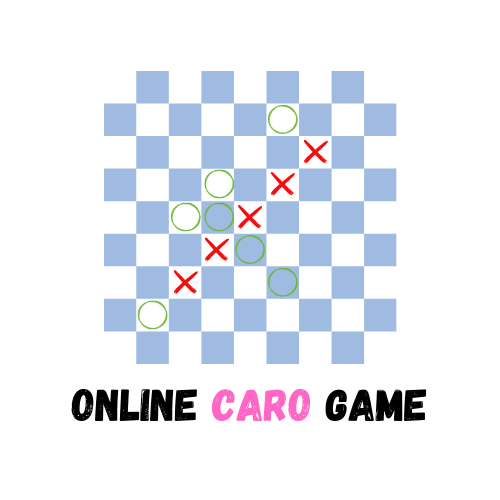
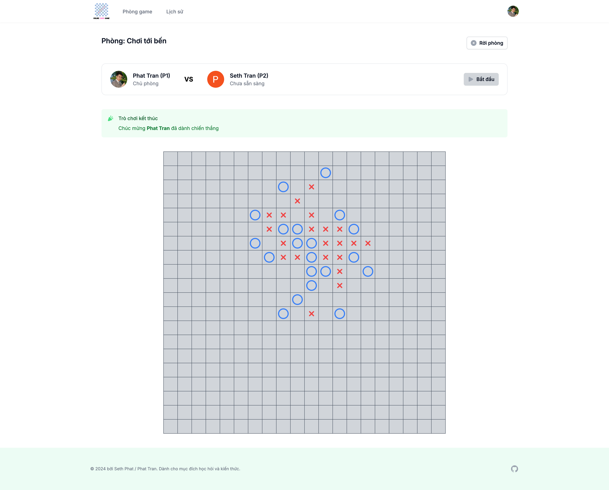

# Laravel Caro x Seth Phat

    

Laravel Caro là một ứng dụng game Caro Online realtime đơn giản. Viết bởi [@sethsandaru](https://github.com/sethsandaru)

Đây là một trong những dự án mà mình mong muốn implement từ lâu 🥰, dự định từ thời sinh viên nhưng đến nay mới 
rảnh rỗi để viết.

Với việc ra mắt Laravel Reverb khi Laravel 11 ra mắt, việc implement realtime nay lại dễ dàng hơn 🔥

## Tech Stuff

- PHP 8.2+
- Laravel 11
- Laravel Reverb (WebSocket)
- MySQL
- Node 18+
- Vue x TypeScript
- TailwindCSS

## Cài đặt và chạy thử

Làm theo các bước sau đây: [Setup](./SETUP.md)

## Để chơi được

- Tạo tài khoản (thông qua đăng nhập Google)
- Tạo phòng
- Đợi người chơi thứ 2 vào phòng (thông qua URL hoặc rooms list)
- Đợi người chơi thứ 2 chuyển sang trạng thái "Sẵn Sàng"
- Chơi
- Kết quả sẽ được tính trên Backend

## Features có thể làm

- Chatbox giữa 2 người chơi
- Chặn 2 đầu thì ko dc thắng
- Kick người chơi
- Bảng xếp hạng (ngày, tuần, tháng, năm)
- Lịch sử thi đấu
- Lịch sử từng nước đi
- Time limit (nếu sau **x** seconds mà ko đi thì mặc định thua)

## Improvement có thể thêm
- Tạo ra các reusable components (button, avatar,...)

## Learning notes

Dành cho các bạn quan tâm học hỏi để tiếp thu thêm kiến thức + kinh nghiệm thực chiến với Laravel.

### Tests

Tests là phần không thể thiếu trong các backend apps hiện nay. Project này cũng vậy.

Để học cách viết tests, hãy tham khảo thư mục `tests`

Project này bao gồm: Unit Tests và Feature Tests.

### Continuous Integration / CI

Project này sử dụng GitHub Actions để chạy Continuous Integration (CI) process. Tham khảo thư mục `.github/workflows` để tìm hiểu thêm.

Workflow cơ bản:

- Pull project
- Setup dependencies
- Setup ENV
- Chạy tests
- Hoàn tất

### Login with Google

Thay vì sử dụng Socialite của Laravel, mình viết 1 cái service đơn giản để login với Google.

Về cơ bản thì nó đơn giản, 2 APIs call và hết. Không cần phải cài thêm package cho mệt.

## Lưu ý

Đây là một sản phẩn Open Source để chia sẻ kiến thức theo MIT License.

## Powered by

Seth Phat 2024
