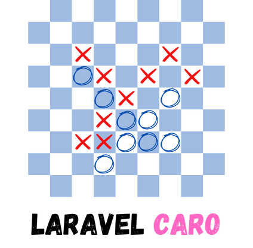

# Laravel Caro x Seth Phat

Laravel Caro là một ứng dụng game Caro Online realtime đơn giản. Viết bởi [@sethsandaru](https://github.com/sethsandaru)

Đây là một trong những dự án mà mình mong muốn implement từ lâu 🥰, dự định từ thời sinh viên nhưng đến nay mới 
rảnh rỗi để viết.

Với việc ra mắt Laravel Reverb khi Laravel 11 ra mắt, việc implement realtime nay lại dễ dàng hơn 🔥

## Tech Stuff

- PHP 8.3
- Laravel 11
- Laravel Reverb
- MySQL
- Vue x TypeScript
- TailwindCSS

## Để chơi được

- Tạo tài khoản (thông qua đăng nhập Google)
- Tạo phòng
- Đợi người chơi thứ 2 vào phòng (thông qua URL hoặc rooms list)
- Đợi người chơi thứ 2 chuyển sang trạng thái "Sẵn Sàng"
- Chơi
- Kết quả sẽ được tính trên Backend

